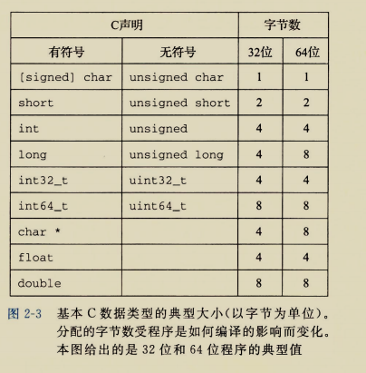

[TOC]

# 信息的表示和处理

## 三种最重要的数字表示

- `无符号编码`:基于传统的二进制表示法，表示大于或者等于零的数字
- `补码`:表示有符号整数的最常见的方式，有符号整数就是可以为正或者为负的数字
- `浮点数`:是表示实数的科学计数法的以2为基数的版本

计算机的表示方法是用有限数量的位来对一个数字编码，结果太大会溢出，但是对于整数运算，整数的计算机运算满足人们所熟知的真正整数运算的许多性质。


这些结果都是-884901888（溢出）

但是浮点运算则有完全不同的数学属性，溢出会产生特殊值$$+\infty$$,但是一组正数的值总是正的。由于表示的精度有限，浮点运算有时是不可结合的。例如，(3.14+1e20)-1e20求得的值会是0.0，而3.14+(1e20-1e20)求得的值会是3.14.

`注意`:

- 整数的表示虽然只能编码一个相对较小的数值范围，但是这种表示是精确地
- 而浮点数虽然可以编码一个较大的数值范围，但是这种表示只是近似的。

## 信息存储

- 最小的可寻址的内存单元：`字节`(8位的块)

- 机器级程序将内存视为一个非常大的字节数组，成为`虚拟内存`(`virtual memory`)

- 内存的每个字节都由一个唯一的数字来表示，成为它的`地址`(`address`).

- 所有可能地址集合就称为`虚拟地址空间`(`virtual address space`)

### 十六进制表示法

一个字节由八位组成，值域位

​				$$00000000_{2}\sim 11111111_{2}$$,

二进制表示过于冗长，十进制不易转换，采用`十六进制`,

用十六进制表示法书写，一个字节的值域位

​							$$00_{16} \sim FF_{16}$$


C语言中，以0x或者0X开头的数字是十六进制的值

各进制之间的转换，特别是十进制和十六进制之间的转换：


### 字数据大小

- `字长`:每台计算机都有一个字长(word size)，指明指针数据的标称大小。

解释：因为虚拟地址是以这样的一个字来编码的，所以字长决定的最重要的系统参数就是虚拟地址空间的最大大小，也就是说，对于一个字长为w位的机器而言，虚拟地址的范围为

​							$$0 \sim 2_{w}-1$$

程序最多访问

​							$$2_{w}$$

字节。

>
>
>字长（word size）指的是计算机处理器在一次运算或数据处理操作中，能够同时处理的二进制位数。字长直接决定了处理器在一条指令中可以处理的数据量的大小，影响了计算机的性能、存储容量和指令集设计。
>
>### 字长的具体表现：
>1. **处理器处理数据的能力**：字长决定了CPU一次能够处理的二进制位数。例如，32位处理器一次能处理32位二进制数据，而64位处理器一次能处理64位二进制数据。
>
>2. **内存寻址能力**：字长影响处理器能够寻址的内存空间大小。例如，在32位处理器中，最大可寻址内存为2^32个字节（即4GB）；而在64位处理器中，最大可寻址内存空间可达到2^64个字节，理论上是非常庞大的（实际上因其他技术因素限制通常不到此上限）。
>
>3. **指令集架构（ISA）**：字长决定了处理器的指令宽度，影响了指令的格式、寄存器大小以及数据操作方式。例如，64位指令集架构（如x86-64）会包含针对64位寄存器的操作指令，而32位指令集架构（如x86）只能处理32位的寄存器。
>
>4. **性能**：较大的字长意味着处理器能够在一次运算中处理更多的数据，通常会提高程序的运行效率。然而，实际的性能提升还取决于应用程序和操作系统是否能够充分利用这种大字长。
>
>5. **硬件设计**：字长影响到计算机硬件设计中的其他部分，比如寄存器、总线、ALU（算术逻辑单元）等的设计。字长越大，通常硬件的复杂性、成本和功耗都会增加。
>
>### 常见的字长：
>- **8位**：早期的微处理器通常为8位，如Intel 8080。
>- **16位**：如Intel 8086，广泛用于20世纪80年代。
>- **32位**：如Intel 80386、ARM Cortex-A32等，现代计算机中曾经非常流行。
>- **64位**：现代计算机的主流字长，常见于x86-64、ARM64架构的处理器中。
>
>总结来说，字长是计算机体系结构中一个重要的指标，它不仅影响处理器的设计，还影响到整个计算机系统的性能和使用体验。

C语言各数据类型分配的字节数。



### 寻址和字节顺序

在几乎所有机器上，多字节对象都被存储为连续的字节序列，对象的地址为所使用字节的`最小的地址。`

排列表示对象的两个通用规则：

考虑一个`w`位的整数，位表示为

​		$$[x_{w-1},x_{w-2},…,x_{0}]$$

- 最高有效位:
  $$
  x_{w-1}
  $$

- 最低有效位
  $$
  x_{0}
  $$

假设w是8的倍数，这些位就能被划分为字节，其中`最高有效字节`包含位
$$
[x_{w-1},x_{w-2},…,x_{w-8}]
$$
`最低有效字节`
$$
[x_{7},x_{6},…,x_{0}]
$$
排序规则：

- `小端法`:某些机器选择在内存中按照从最低有效字节到最高有效字节的顺序存储对象
- `大端法`:另一些机器则按照从最高有效字节到最低有效字节的顺序存储

例子：


一段使用强制类型转换来访问和打印不同程序对象的字节表示

```cpp
#include<stdio.h>
typedef unsigned char *byte_pointer;
void show_bytes(byte_pointer start,size_t len){
    size_t len;
    for(i =0;i<len;i++){
        printf("%.2x",start[i]);
    }
    printf("\n");
}
void show_int(int x){
    show_bytes((byte_pointer)&x,sizeof(int));
}
void show_float(float x){
    show_bytes((byte_pointer)&x,sizeof(float));
}
void show_pointer(void *x){
    show_bytes((byte_pointer)&x,sizeof(void*x));
}
void test_show_bytes(int val){
    int ival=val;
    float fval=(float)ival;
    int *pval=&ival;
    show_int(ival);
    show_float(fval);
    show_pointer(pval);
}
```


